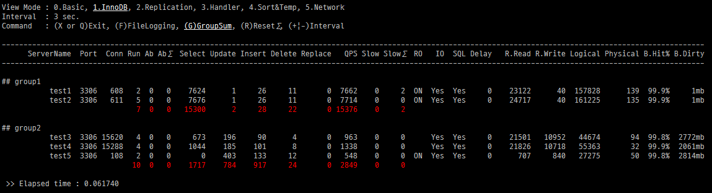
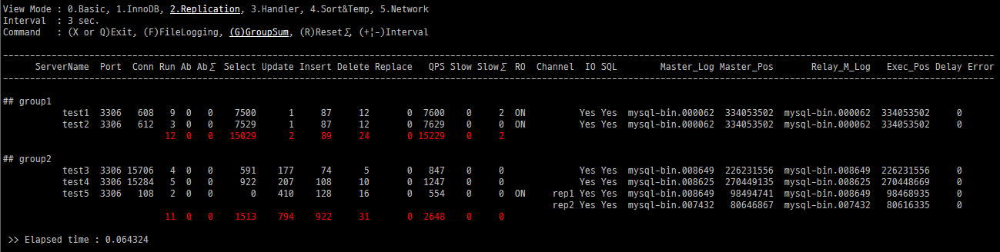

Watchtower (for MySQL + Docker)
======================

### Watchtower
Watchtower is a Python application designed for monitoring multiple MySQL instances in Docker, specifically built for Prowl.


#### Usage

Server list file is a CSV file that contains the Prowl group name, the Prowl hostname as well as the MySQL port.
```
cat serverlist.txt
group1,test1,3306
group1,test2,3306
group2,test3,3307
group2,test4,3307
```
#### Create a MySQL user account 
````
GRANT REPLICATION CLIENT ON *.*  to {USER}@{MONITOR_SERVER_IP} IDENTIFIED BY '{PASSWORD}';
````
#### Run Watchtower
````
python watchtower.py serverlist.txt USER PASS
````


#### Replication Mode


Written by Montana Mendy for Prowl, LLC.
